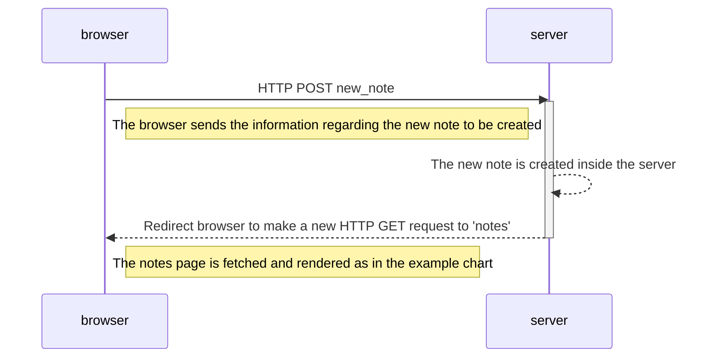

0.4: uusi muistiinpano

```mermaid
sequenceDiagram
    participant browser
    participant server
    
    browser->>server: HTTP POST new_note
    activate server
Note right of browser: The browser sends the information regarding the new note to be created
    server-->>server:  The new note is created inside the server
    server-->>browser: Redirect browser to make a new HTTP GET request to 'notes'
    deactivate server
Note right of browser: The notes page is fetched and rendered as in the example chart
```
